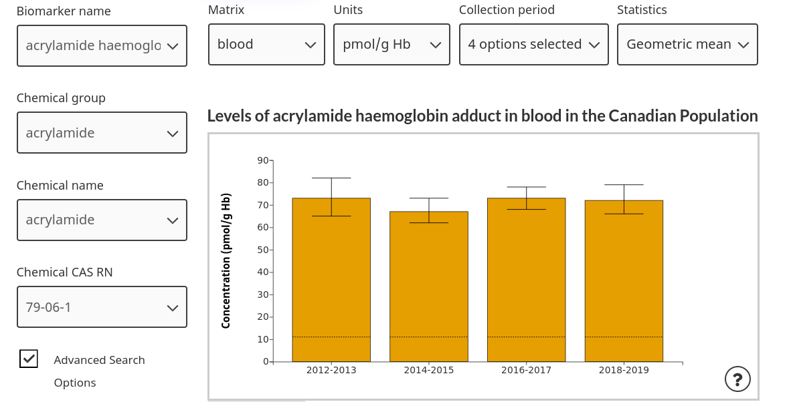
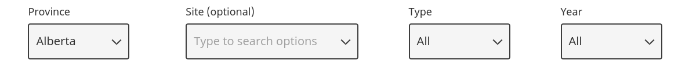
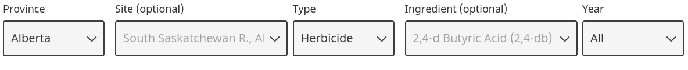
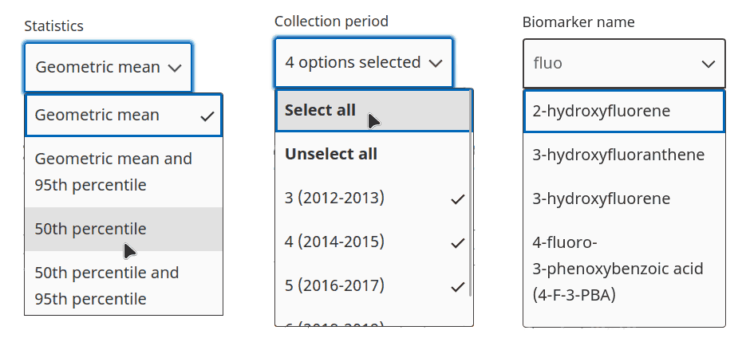

# Multi Search Dropdowns

This is a class to create W3C-WAI **accessible dropdowns with multiple select, search, and logical form section display**. I created this for the Public Health Infobase team at the Public Health Agency of Canada.

## Examples
Dropdowns in different orientations 

A dropdown form showing different sections using conditional logic.
 
 
 

Different dropdowns with single select, multiselect, and search options toggled on and off.


## Quickstart
Download the files at `/dist/drop.css` and `/dist/drop.js` to a directory.

Create a file in that directory called `index.html`. Put the following in it: 

```html
(index.html)
---------------------------------
<!DOCTYPE html>
<html lang="en">
<head>
    <link rel="stylesheet" href="/drop.css" type="text/css" />
</head>
<body>
    <script src='/drop.js' type='module'></script>
    <script src='/main.js' type='module'></script>
</body>
</html>
```

Next, make a file in that directory called `main.js`. In this file, **you'll create Javascript objects to set the options of your dropdowns**.

Before setting these options, put this boilerplate code in `main.js`:

```js
(main.js)
---------------------------------
import { Dropdown } from '/drop.js';

const drop = new Dropdown();
const initSettings = [{}, {}]; // to be updated

// An EMPTY div to be the parent of the dropdowns
drop.rootDOM = document.body;
// Dropdown settings for each section
drop.sections = initSettings;

// Replace this with your own callback later
// Ex: To show a graph after values are selected
drop.onStateUpdate = (value) => console.log(value);

// Render the dropdowns
drop.init();
```

Finally, put these basic options in `main.js`:
```js
(main.js)
---------------------------------
import { Dropdown } from '/drop.js';

const drop = new Dropdown();
const initSettings = [
    {
        // unique section id
        'sectionID': 'region-section',
        // heading over this section's dropdowns
        'sectionTitle': 'Choose a location',
        // 0th section displays first
        // 1st section displays after user interacts with 0th
        // and so on
        'sectionOrder': 0,
        // unique dropdown id(s). Array of 1+ values
        'dropIDs': ['province-dropdown', 'city-dropdown'],
        // dropdown labels
        'dropTitles': ['Province', 'Town/City'],
        // 0th dropdown displays first
        // 1st dropdown displays after user interacts with 0th
        // and so on
        'dropOrder': [0, 1],
        // options for each dropdown
        // array of arrays
        'dropOptions': [
            ['Alberta', 'British Columbia', 'Manitoba'],
            ['Edmonton', 'Calgary', 'Victoria', 'Vancouver', 'Winnipeg', 'Brandon']
        ],
        // Should dropdowns allow multiple selections?
        'dropMulti': [false, true],
        // Should dropdowns allow search?
        'dropSearch': [false, true],
        // Should dropdowns autoselect options on render?
        // (single select dropdowns select first option)
        // (multi select dropdowns select all)
        'dropInit': [false, false]
    }, 
    {
        'sectionID': 'time-section',
        // no heading so no sectionTitle
        'sectionOrder': 1,
        'dropIDs': ['year-dropdown'],
        'dropTitles': ['Year'],
        'dropOrder': [0],
        'dropOptions': [
            ['2020', '2021', '2022', '2023']
        ],
        'dropMulti': [false],
        'dropSearch': [false],
        'dropInit': [true]
    }];

// An EMPTY div to be the parent of the dropdowns
drop.rootDOM = document.body;
// Dropdown settings for each section
drop.sections = initSettings;

// Replace this with your own callback later
// Ex: To show a graph after values are selected
drop.onStateUpdate = (value) => console.log(value);

// Render the dropdowns
drop.init();
```

**See [documentation.md](/documentation.md) for more details about all possible class settings, methods, and fields.**